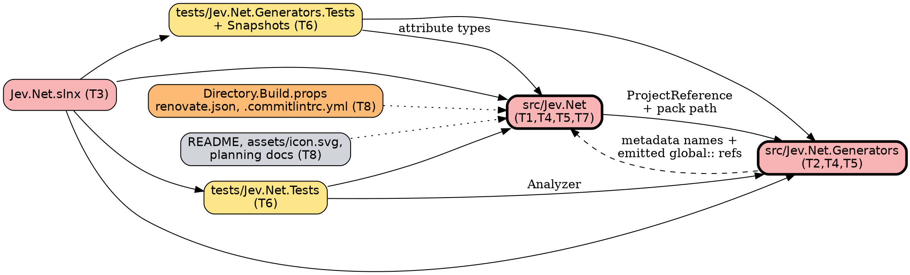

# Impact Analysis: Phase 1.5 — rename Jev.Net to ZeroAlloc.Jev

Spec: `docs/superpowers/specs/2026-09-27-phase-1.5-rename-to-zeroalloc-jev-design.md`. Targets confirmed with the maintainer on 2026-09-27. This analysis covers the rename and the conformance edits to existing files; new additions (AOT smoke app, `.github` workflows, release-please files, ruleset, follow-up issues) are planned directly and are not part of the blast radius.

## Summary

| Metric | Value |
|---|---|
| Date | 2026-09-27 |
| Refactor Type | Rename + move (namespace, projects, folders, assembly and package identity) |
| Targets | 8 (T1–T8) |
| Directly Affected Files | 93 (85 tracked files outside `docs/` containing `Jev.Net`, 4 living planning docs, `Directory.Build.props`, `renovate.json`, `.commitlintrc.yml`, `assets/logo.svg`) |
| Transitively Affected Files | 0 — every dependent already names the namespace directly; the only consumers of generated code are the two test projects |
| Total Affected Files | 93 |
| Breaking Changes | 81 (every `.cs`, `.csproj`, `.slnx`, `PublicAPI` and snapshot file) |
| Risks Identified | 8 |
| Risk Level | High by file count (> 50) — but the change is mechanical and verified by the compiler, 235 tests and generator snapshots |

Occurrences: 427 of `Jev.Net` across the 85 tracked files outside `docs/`.

## Targets

| # | Target | Type |
|---|---|---|
| T1 | Root namespace `Jev.Net`, `Jev.Net.Serialization`, `Jev.Net.Transport` → `ZeroAlloc.Jev.*` | Rename |
| T2 | Generator namespace and project `Jev.Net.Generators` → `ZeroAlloc.Jev.Generator` (singular) | Rename + move |
| T3 | Folders, project files and solution: `src/Jev.Net`, `src/Jev.Net.Generators`, `tests/Jev.Net.Tests`, `tests/Jev.Net.Generators.Tests`, `Jev.Net.slnx` | Move |
| T4 | Assembly and package identity: `RootNamespace`, `PackageId`, `Title`, assembly names (from project names), `InternalsVisibleTo`, `ProjectReference` paths, generator pack path | Rename |
| T5 | String literals the compiler cannot check: generator metadata names, emitted `global::` references, diagnostic category, User-Agent product token, csproj comments | Rename (dynamic) |
| T6 | Test namespaces, test-source string literals (`using Jev.Net;` inside compiled snippets), 5 generator snapshots, harness comment | Rename + test impact |
| T7 | `PublicAPI.Shipped.txt` / `PublicAPI.Unshipped.txt` — every entry carries the namespace | Regenerate |
| T8 | `README.md`, `assets/logo.svg` → `assets/icon.svg`, `Directory.Build.props` (repository/project URLs, `IsPackable` pattern), `renovate.json`, `.commitlintrc.yml`, `docs/planning/{ROADMAP,MILESTONE,STATE,CONVENTIONS}.md` | Update |

Name mapping, applied **in this order** so the singular generator name is not lost: `Jev.Net.Generators` → `ZeroAlloc.Jev.Generator`, then `Jev.Net` → `ZeroAlloc.Jev`. This yields `ZeroAlloc.Jev.Generator.Tests`, `ZeroAlloc.Jev.Tests`, `ZeroAlloc.Jev.Serialization`, `ZeroAlloc.Jev.Transport` and `ZeroAlloc.Jev.slnx` without special cases.

## Dependency Graph

Red = Breaking, yellow = Test Impact, orange = Update Required, grey = Cosmetic; bold border = rename targets. The dashed edge is the string-literal coupling that no compiler checks: the generator finds attributes by metadata name and emits `global::` references into consumer code.

## Affected Files

| # | File(s) | Classification | Change Required | Caused By | Complexity |
|---|---|---|---|---|---|
| 1 | `src/Jev.Net/**/*.cs` (44 files incl. `Serialization/`, `Transport/`) | Breaking | `namespace`/`using` `Jev.Net*` → `ZeroAlloc.Jev*`; doc comment in `JevQuestionsAttribute.cs` | T1 | Trivial |
| 2 | `src/Jev.Net/JevClient.cs:227,231` | Breaking (behaviour) | `ProductInfoHeaderValue("Jev.Net", …)` → `"ZeroAlloc.Jev"` | T5 | Trivial |
| 3 | `src/Jev.Net/Jev.Net.csproj` | Breaking | Move to `src/ZeroAlloc.Jev/ZeroAlloc.Jev.csproj`; `RootNamespace`, `PackageId`, `Title` → `ZeroAlloc.Jev`; `Description` updated; generator `ProjectReference` and pack path → `..\ZeroAlloc.Jev.Generator\…\ZeroAlloc.Jev.Generator.dll`; `InternalsVisibleTo` → `ZeroAlloc.Jev.Tests`; comments | T3, T4, T5 | Trivial |
| 4 | `src/Jev.Net/PublicAPI.Shipped.txt`, `PublicAPI.Unshipped.txt` | Breaking | Every `Jev.Net.` entry → `ZeroAlloc.Jev.` (text replacement is exactly what the code fix would produce for a pure namespace change; RS0016/RS0017 at build time verify it) | T7 | Trivial |
| 5 | `src/Jev.Net.Generators/**/*.cs` (10 files) | Breaking | Move to `src/ZeroAlloc.Jev.Generator/`; namespace `Jev.Net.Generators` → `ZeroAlloc.Jev.Generator` | T2 | Trivial |
| 6 | `src/Jev.Net.Generators/ModelBuilder.cs:11-15,111,140-141` | Breaking (silent) | Metadata names `"Jev.Net.*Attribute"`, `"Jev.Net.Noul"`, `"Jev.Net.Choice<T>"`, `"Jev.Net.Score<T>"` → `ZeroAlloc.Jev.*` | T5 | Trivial |
| 7 | `src/Jev.Net.Generators/QuestionSetGenerator.cs:17` | Breaking (silent) | `ForAttributeWithMetadataName("Jev.Net.JevQuestionsAttribute")` → `"ZeroAlloc.Jev.JevQuestionsAttribute"` | T5 | Trivial |
| 8 | `src/Jev.Net.Generators/SourceEmitter.cs:9,28,139,262-264` | Breaking (silent) | Emitted `global::Jev.Net.*` → `global::ZeroAlloc.Jev.*` | T5 | Trivial |
| 9 | `src/Jev.Net.Generators/Diagnostics.cs:8`, `AnalyzerReleases.Unshipped.md:8-13` | Breaking | Category `"Jev.Net.Generators"` → `"ZeroAlloc.Jev.Generator"` in both (RS2008 checks they agree) | T5 | Trivial |
| 10 | `src/Jev.Net.Generators/Jev.Net.Generators.csproj` | Breaking | Move to `ZeroAlloc.Jev.Generator.csproj`; `RootNamespace`; `InternalsVisibleTo` → `ZeroAlloc.Jev.Generator.Tests` | T3, T4 | Trivial |
| 11 | `Jev.Net.slnx` | Breaking | Move to `ZeroAlloc.Jev.slnx`; four project paths | T3 | Trivial |
| 12 | `tests/Jev.Net.Tests/**` (17 `.cs`, csproj) | Test Impact | Move to `tests/ZeroAlloc.Jev.Tests/`; namespaces; `ProjectReference` paths; `JevClientTests.cs:197` asserts `"ZeroAlloc.Jev/"` | T3, T5, T6 | Trivial |
| 13 | `tests/Jev.Net.Generators.Tests/**` (6 `.cs`, csproj) | Test Impact | Move to `tests/ZeroAlloc.Jev.Generator.Tests/`; namespaces; `using Jev.Net;` inside compiled source strings (`Sources.cs`, `DiagnosticTests.cs:29`, `GeneratorTests.cs:52`); harness comment; `ProjectReference` paths | T3, T6 | Trivial |
| 14 | `tests/Jev.Net.Generators.Tests/Snapshots/*.verified.cs` (5 files) | Test Impact | Regenerate with `ZA_SNAPSHOT_UPDATE=1`; the diff must be only `global::Jev.Net` → `global::ZeroAlloc.Jev` | T6 | Trivial |
| 15 | `Directory.Build.props` | Update Required | Add `PackageProjectUrl` `https://jev.zeroalloc.net`, `RepositoryUrl` `https://github.com/ZeroAlloc-Net/ZeroAlloc.Jev`, `RepositoryType` `git`; switch the packable opt-in to the org's opt-out pattern (`.Tests`, `.Benchmarks`, `.AotSmoke` names non-packable; generator explicitly `IsPackable=false`) | T8 | Moderate |
| 16 | `renovate.json`, `.commitlintrc.yml` | Update Required | Renovate extends the org config; commitlint keeps planning scopes and adds `generator`, `samples`, `ci` if absent | T8 | Trivial |
| 17 | `assets/logo.svg` | Update Required | `git mv` to `assets/icon.svg` | T8 | Trivial |
| 18 | `README.md` | Cosmetic (public-facing) | Title, install line `dotnet add package ZeroAlloc.Jev`, text; unofficial-client disclaimer kept | T8 | Trivial |
| 19 | `docs/planning/ROADMAP.md`, `MILESTONE.md`, `STATE.md`, `CONVENTIONS.md` | Cosmetic | Living references to the package, projects and DI package name → `ZeroAlloc.Jev*`; historical sentences that describe the rename keep the old name | T8 | Trivial |

Not changed: dated specs and plans under `docs/superpowers/` and `docs/plans/` (historical records); fixtures under `tests/*/Fixtures/` (contain no `Jev.Net`); upstream issues #335 and #336; the local working folder.

## Risk Register

| # | Risk | Affected Files | Severity | Mitigation |
|---|---|---|---|---|
| 1 | **Silent string coupling** — a missed metadata name makes the generator find no attributes; code still compiles but no source is generated, then the partial properties fail with CS9248 only in consumers | `ModelBuilder.cs`, `QuestionSetGenerator.cs`, `SourceEmitter.cs` | High | The end-to-end tests in the main test project and the generator snapshots fail loudly; final repository-wide search for `Jev.Net` |
| 2 | **Replacement order** — replacing `Jev.Net` before `Jev.Net.Generators` produces `ZeroAlloc.Jev.Generators` (plural) | all generator files and references | Medium | Replace `Jev.Net.Generators` first, then `Jev.Net`; search for `ZeroAlloc.Jev.Generators` afterwards (must be zero) |
| 3 | **Escape-sensitive files** — scripted text replacement could decode backslash-u sequences | `tests/*/JsonTextTests.cs`, `JevAnswerReaderTests.cs`, `QuestionSets.cs`, `JsonText.cs` | Medium | Replace with a byte-preserving tool (python reading and writing UTF-8, replacing only the literal `Jev.Net` substrings); verify with `chr(92)` checks and `git diff --stat` that only expected lines changed |
| 4 | **Name lookup inside `namespace ZeroAlloc.Jev`** — the parent namespace `ZeroAlloc` now contains `Rest`, `Results`, … so an unqualified identifier named like a sibling namespace could bind differently | all `.cs` | Low | No identifiers named `Rest`, `Results`, `Resilience` exist; generated ZeroAlloc.Rest code uses fully qualified names; the compiler reports any ambiguity |
| 5 | **Build caches** — stale `bin/obj` under the old folder names confuse the generator pack path or tests | build outputs | Low | Delete the old `bin/` and `obj/` folders after `git mv`; build from clean |
| 6 | **Snapshot churn masking a real change** | 5 snapshot files | Medium | Review the regenerated snapshot diff: only namespace substitutions allowed |
| 7 | **External consumers** | none — the package was never published | None | — |
| 8 | **History and public docs mention `Jev.Net`** — the public repository already shows the old name in commits and dated docs | git history, dated docs | Low | Intended: dated records stay; README and living docs carry the new name |

## Execution Order

### Group 1: Rename (atomic)
Nothing compiles halfway through a namespace rename across four projects, so this is one atomic group:
1. `git mv` the four project folders, the four project files, the solution file and `assets/logo.svg` → `assets/icon.svg`; delete old `bin/` and `obj/`.
2. Text replacement over tracked files in `src/`, `tests/`, the solution and `README.md`: `Jev.Net.Generators` → `ZeroAlloc.Jev.Generator`, then `Jev.Net` → `ZeroAlloc.Jev` (byte-preserving).
3. Verify: zero `Jev.Net` and zero `ZeroAlloc.Jev.Generators` left in those paths; escape-sensitive files unchanged apart from the namespace lines.
4. Regenerate generator snapshots with `ZA_SNAPSHOT_UPDATE=1` and review.
- **Checkpoint:** Release build with 0 warnings (RS0016/RS0017 confirm the PublicAPI text), all 235 tests pass, pack shows `ZeroAlloc.Jev.nupkg` with `analyzers/dotnet/cs/ZeroAlloc.Jev.Generator.dll`; commit.

### Group 2: Org conformance of existing configuration
- `Directory.Build.props` (URLs, packable opt-out pattern), `renovate.json`, `.commitlintrc.yml`, package `Description`.
- **Checkpoint:** build, test, pack (nuspec shows repository and project URLs, icon, README; tests and generator not packed); commit.

### Group 3: Living documentation
- `README.md` wording beyond the mechanical replacement; `docs/planning/ROADMAP.md`, `MILESTONE.md`, `STATE.md`, `CONVENTIONS.md`.
- **Checkpoint:** repository-wide search: `Jev.Net` only in dated historical docs and in sentences describing the rename; commit.

New additions (AOT smoke app, `.github` workflows, release-please files, follow-up issues, ruleset) follow Group 3 in the plan and do not affect this ordering, except that the AOT smoke app and CI must use the new names from the start.
