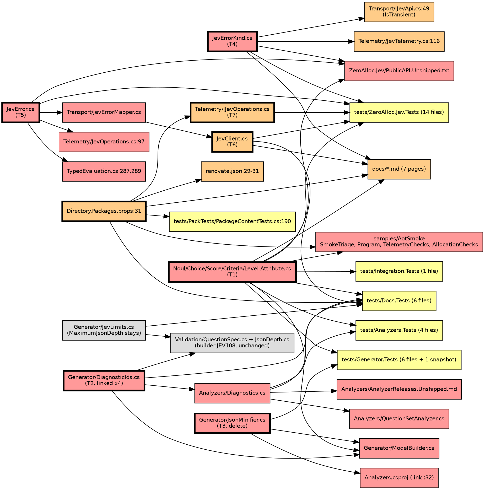

# Impact Analysis: Phase 5.1 public API review

Spec: `docs/superpowers/specs/2026-10-04-phase-5.1-public-api-review-design.md`. Method: refactor-analysis, Phases 2 to 7. Phase 1 (the target list) was confirmed by the maintainer. Branch `phase/5.1-api-review`. Read-only analysis: nothing in the repository was changed except this file.

## Summary

| Metric | Value |
|---|---|
| Date | 2026-10-04 |
| Refactor Type | Change interface (public API of `ZeroAlloc.Jev`), plus a delete of the attribute JSON path and a dependency bump |
| Targets | 7 (T1 to T7) |
| Directly Affected Files | 49 |
| Transitively Affected Files | 26 |
| Total Affected Files | 75 |
| Breaking Changes | 19 (files that fail to build or run without a change: src, samples, build config) |
| Risks Identified | 12 |
| Risk Level | High (more than 50 affected files, and one high-severity risk with an unknown API) |

"Direct" means the file names the target symbol or is the target. "Transitive" means it depends on a direct file's changed contract or on a test or doc that is tied to it. Test files that stop compiling are classified Test Impact and flagged "build-blocking" in the table, since they stop the solution building.

Depth limit: none reached. Closure ended after two rounds. The second round found: `DiagnosticIds.cs` (linked into the library, generator, analyzers and code fixes), `JevLimits.cs` (linked into the library and analyzers), `AnalyzerReleases.Unshipped.md` (release tracking is an error under `TreatWarningsAsErrors`, `Directory.Build.props:8`), and the docs tests that read source files by path.

### Findings that change the plan

1. **JEV108 has two emitters, and only one goes.** The generator reports it from `ModelBuilder.cs:774` via `DiagnosticIds.InvalidJson`. The run-time builder reports it from `Validation/QuestionSpec.cs:174` (depth check) through the same constant. So `DiagnosticIds.InvalidJson` stays. `Diagnostics.InvalidJson` (`Analyzers/Diagnostics.cs:119-124`) has no emitter once the attribute branch is gone.
2. **The docs table tests are tied to the analyzer descriptors, not to the builder.** `DiagnosticsTests.cs:35-48` asserts that the `docs/diagnostics.md` rule table equals the descriptors in `Analyzers/Diagnostics.cs` (count 15, line 40), and `:50-62` asserts it equals `AnalyzerReleases.Shipped.md`. A JEV108 row kept in the table "for the builder" is a mismatch with both unless the test changes or the analyzer descriptor stays as a dead descriptor. This needs a decision in the plan. It is stated here, not decided.
3. **JEV003 also loses a JSON branch.** `ModelBuilder.cs:28` (`EmptyJsonAdvice`) and `:643-668` report `{}` and `[]` as empty text; the message test is `MovedDiagnosticTests.cs:129-140`, and the docs row is `docs/diagnostics.md:46`. The maintainer's T2 does not list this; it follows from removing `Json = true`.
4. **`JevLimits.MaximumJsonDepth` stays live.** See risk 3.
5. **Telemetry 1.11.0 is in the local cache** and it adds `TraceAttribute.ExceptionDescription` (bool). See T7 below.

## Dependency Graph

Red = Breaking, orange = Update Required, yellow = Test Impact, gray = Cosmetic. Bold border = a target.

## Affected Files

Sorted Breaking, Update Required, Test Impact, Cosmetic. "(build-blocking)" means the project does not compile until the file changes. Line numbers are in the current tree.

| # | File | Classification | Change Required | Caused By | Complexity |
|---|---|---|---|---|---|
| 1 | src/ZeroAlloc.Jev/NoulAttribute.cs | Breaking | Delete `Json` at :17-22 | T1 (target) | Trivial |
| 2 | src/ZeroAlloc.Jev/ChoiceAttribute.cs | Breaking | Delete `Json` at :17-21 | T1 (target) | Trivial |
| 3 | src/ZeroAlloc.Jev/ScoreAttribute.cs | Breaking | Delete `Json` at :17-21 | T1 (target) | Trivial |
| 4 | src/ZeroAlloc.Jev/CriteriaAttribute.cs | Breaking | Delete `Json` at :24-28; the `Examples` / `NotFor` docs cite JEV109 at :26 | T1 (target), T2 | Trivial |
| 5 | src/ZeroAlloc.Jev/LevelAttribute.cs | Breaking | Delete `Json` at :21-25; docs cite JEV109 at :23 | T1 (target), T2 | Trivial |
| 6 | src/ZeroAlloc.Jev/PublicAPI.Unshipped.txt | Breaking | Now only `#nullable enable`. Needs `*REMOVED*` for Shipped.txt :101-102, :129-130, :320-321, :352-353, :407-408 (the ten `Json` accessors), :215 (the old `JevError` constructor) and :221-231 (the eleven `JevErrorKind` members, which carry values 0 to 10), plus the new entries. RS0016 and RS0017 are errors (`Directory.Build.props:16`) | T1, T4, T5 | Moderate |
| 7 | src/ZeroAlloc.Jev/JevError.cs | Breaking | Constructor :24-41 becomes `(kind, message)`; `StatusCode`, `RetryAfter`, `Detail`, `Exception` (:50-62) become `init`. `Failures` (:71) stays get-only, set by the internal constructor :45-49, which chains to `this(JevErrorKind.InvalidQuestions, message)` and still compiles | T5 (target) | Moderate |
| 8 | src/ZeroAlloc.Jev/JevErrorKind.cs | Breaking | Explicit values from 1 for the eleven members, no zero member, new `Disposed` member with XML docs | T4 (target) | Trivial |
| 9 | src/ZeroAlloc.Jev/Transport/JevErrorMapper.cs | Breaking | Named and positional optional arguments at :18, :19-20, :21-25, :27-31 and :48-53 become object initializers. `new JevErrorMapper(time)` is built at `JevClient.cs:193` with no access to client state | T5, T6 | Moderate |
| 10 | src/ZeroAlloc.Jev/Telemetry/JevOperations.cs | Breaking | :97 `statusCode: 200` named argument | T5 | Trivial |
| 11 | src/ZeroAlloc.Jev/TypedEvaluation.cs | Breaking | :287 (`statusCode`, `exception:`) and :289 (third positional argument) | T5 | Trivial |
| 12 | src/ZeroAlloc.Jev.Generator/JsonMinifier.cs | Breaking | Delete the file. It also defines `MinifyResult` (used at `ModelBuilder.cs:659`, :757, :829, :1016) | T3 (target) | Trivial |
| 13 | src/ZeroAlloc.Jev.Generator/ModelBuilder.cs | Breaking | Remove `JsonMinifier.Minify` call :770 and the `Json` branches. `TextOrJsonFragment` :752-781 and `DescriptionFragment` :817-875 reduce to the plain-text and `Examples` / `NotFor` paths. `CheckText` :643-668 loses the JSON branch and `EmptyJsonAdvice` :28. `CheckReferences` :1006-1029 loses its `MinifyResult` parameter. Call sites :437-439, :576-577, :591-592. `NamedBool(attribute, "Json")` is string-based, so it would compile but is dead | T2, T3 | Complex |
| 14 | src/ZeroAlloc.Jev.Analyzers/ZeroAlloc.Jev.Analyzers.csproj | Breaking | Remove the link at :32 (`JsonMinifier.cs`). `JsonText.cs` :31 stays: `ModelBuilder` and `SourceEmitter` still use it | T3 | Trivial |
| 15 | src/ZeroAlloc.Jev.Analyzers/Diagnostics.cs | Breaking | Remove `JsonWithExamples` :126-132. `InvalidJson` :118-124 has no emitter after T3 (finding 2). Both title and message strings say "Json = true" | T2 | Trivial |
| 16 | src/ZeroAlloc.Jev.Analyzers/QuestionSetAnalyzer.cs | Breaking | Remove `Diagnostics.InvalidJson` / `Diagnostics.JsonWithExamples` from the supported list at :38-39 | T2 | Trivial |
| 17 | src/ZeroAlloc.Jev.Generator/DiagnosticIds.cs | Breaking | Remove `JsonWithExamples` :26. Keep `InvalidJson` :25 (used by `QuestionSpec.cs:174`). File is linked into the library (`ZeroAlloc.Jev.csproj:75`), analyzers (`:33`) and code fixes (`:30`). `DiagnosticsTests.cs:57` asserts a doc comment in this file, so do not reword that line | T2 (target) | Trivial |
| 18 | src/ZeroAlloc.Jev.Analyzers/AnalyzerReleases.Unshipped.md | Breaking | Add a `### Removed Rules` entry for JEV109, and for JEV108 if its descriptor goes. Currently holds no rules. Release-tracking diagnostics are errors under `TreatWarningsAsErrors` | T2 | Trivial |
| 19 | samples/ZeroAlloc.Jev.AotSmoke/SmokeTriage.cs | Breaking | `Json = true` at :43 (`SmokeTeam.Account`) and :51 (`RequestsCredentials`) | T1 | Moderate |
| 20 | src/ZeroAlloc.Jev/JevClient.cs | Update Required | `_disposed` :36 becomes `volatile`. `ObjectDisposedException.ThrowIf` sites at :239, :267, :289, :305, :334, :355, :370 stay (a call started after `Dispose` still throws). `Dispose` :388-397. The disposal-to-`Disposed` mapping has no home yet: mapper construction is at :193, logging at :424-499 | T6 (target) | Complex |
| 21 | src/ZeroAlloc.Jev/Transport/IJevApi.cs | Update Required | `IsTransient` :49-51 retries `Network` and `Timeout`. A request torn down by `Dispose` reaches the mapper as a transport or time-out error, so where `Disposed` is decided decides whether the retry proxy keeps retrying a disposed client. `Disposed` is not listed, so it would not be retried | T4, T6 | Moderate |
| 22 | src/ZeroAlloc.Jev/Telemetry/JevTelemetry.cs | Update Required | `ErrorTypeOf` :116-128 needs a `Disposed` arm; the `_ => Other` arm means a missing arm compiles and reports `_OTHER`. Doc at :43 | T4 | Trivial |
| 23 | src/ZeroAlloc.Jev/Telemetry/IJevOperations.cs | Update Required | Four `[Trace(...)]` at :23, :62, :102, :141 each gain the 1.11.0 option for leaving out the exception message (T7 section). Sixteen `error.type` result-path attributes stay | T7 (target) | Moderate |
| 24 | src/ZeroAlloc.Jev/IJevClient.cs | Update Required | XML docs: disposal behaviour for the two cases, and the `Disposed` kind. Existing kind crefs at :31, :50, :81, :102, :147, :184 stay valid | T6 | Trivial |
| 25 | Directory.Packages.props | Update Required | :31 `1.10.0` to `1.11.0`; the comment at :30 says "1.10.0 is the floor" | T7 (target) | Trivial |
| 26 | renovate.json | Update Required | :29-31 pins `allowedVersions: "[1.10.0]"` and its description names 1.10.0. Renovate would revert or block 1.11.0 | T7 | Trivial |
| 27 | samples/ZeroAlloc.Jev.AotSmoke/Program.cs | Update Required | :160-182 `StructuredQuestionSetRoundTrips` asserts the `Json = true` object and criteria (messages at :169, :181) | T1 | Moderate |
| 28 | docs/typed-evaluation.md | Update Required | Delete the "Structured instructions" section :179-207 including the snippet `TypedEvaluation_JsonInstructions`; point to `JevContent` and `JevCriterion.Json` | T1, T2 | Moderate |
| 29 | docs/diagnostics.md | Update Required | :29 (and `JEV101 to JEV109` at :143), :46 (JEV003 JSON clause), :48 (JEV004 `Json = true` clause), :58 and :59 rows; finding 2 | T2 | Moderate |
| 30 | docs/client-and-errors.md | Update Required | Kinds table :258-272 gains `Disposed` and the numbering; `JevError` member table :244-256 (init properties); :69-70 disposal sentence; handling snippet :286-295 (has a `_` arm, compiles as is) | T4, T5, T6 | Moderate |
| 31 | docs/observability.md | Update Required | :310 states the span status description is empty; :316-326 is the exception-path gap note, to remove; :97 and :307 name `JevErrorKind` | T7 | Moderate |
| 32 | docs/testing-your-code.md | Update Required | :140-141 fake builds `JevError(kind, "...")`, which keeps compiling; spec wants init properties shown. :229 links to the kinds table | T4, T5 | Trivial |
| 33 | docs/question-sets-at-run-time.md | Update Required | :257 says a `switch` over `JevErrorKind` needs an `InvalidQuestions` case; add `Disposed`. :196 JEV108 row stays (builder) | T4 | Trivial |
| 34 | docs/performance.md | Update Required | :36 mentions `Json = true`; :115-165 telemetry rows and AOT figures need re-measuring after the bump | T1, T7 | Moderate |
| 35 | docs/native-aot.md | Update Required | :136-141 budget table (6272, 5440, 5760, 5056 bytes), only if a re-measure moves a budget | T7 | Trivial |
| 36 | tests/ZeroAlloc.Jev.Tests/QuestionSets.cs | Test Impact | build-blocking. `Json = true` at :133 (`DuplicateCheck`), :158, :161 (`DeepOption`), :168, :171 (`DeepJsonCheck`); `DeepJson` :150-153 | T1 | Moderate |
| 37 | tests/ZeroAlloc.Jev.Tests/BuilderGeneratorDifferentialTests.cs | Test Impact | build-blocking. `Json = true` at :11 and :42. The differential then no longer compares structured JSON generator-against-builder (risk 8) | T1 | Moderate |
| 38 | tests/ZeroAlloc.Jev.Tests/GeneratedQuestionSetTests.cs | Test Impact | build-blocking once `DuplicateCheck` and `DeepJsonCheck` go: :28, :61 | T1 | Trivial |
| 39 | tests/ZeroAlloc.Jev.Tests/GeneratedQuestionCountTests.cs | Test Impact | build-blocking once `DeepJsonCheck` goes: :18 | T1 | Trivial |
| 40 | tests/ZeroAlloc.Jev.Tests/LoggingJevApiTests.cs | Test Impact | build-blocking. :14 (`503, TimeSpan...` positional), :51 (`408`), :62 (`401`) | T5 | Trivial |
| 41 | tests/ZeroAlloc.Jev.Tests/OperationsProxyTests.cs | Test Impact | build-blocking. :111 (`429`), :187 (`401`) positional. Also :125-126 asserts a result failure has no status description; unchanged by T7 | T5 | Trivial |
| 42 | tests/ZeroAlloc.Jev.Tests/TypedEvaluationDefaultTests.cs | Test Impact | build-blocking. :192 `statusCode: 429` | T5 | Trivial |
| 43 | tests/ZeroAlloc.Jev.Tests/JevLogTests.cs | Test Impact | build-blocking. :229 `200` positional. :213-223 uses two-argument form, unaffected | T5 | Trivial |
| 44 | tests/ZeroAlloc.Jev.Tests/JevTelemetryTests.cs | Test Impact | :11-15 loops `Enum.GetValues<JevErrorKind>()`, so it fails for `Disposed` until `ErrorTypeOf` has the arm. :19 `(JevErrorKind)999` stays undefined. Add: no member is 0 | T4 | Trivial |
| 45 | tests/ZeroAlloc.Jev.Tests/JevClientTests.cs | Test Impact | :288-295 `DisposedClient_Throws` stays; add in-flight `Disposed` test next to :200-231 (owned and borrowed client; a borrowed `HttpClient` is not disposed, so only an owned one can be torn down) | T6 | Moderate |
| 46 | tests/ZeroAlloc.Jev.Tests/JevClientTypedTests.cs | Test Impact | :351-372 disposal tests stay; add a typed in-flight case | T6 | Moderate |
| 47 | tests/ZeroAlloc.Jev.Tests/JevClientQuestionSetTests.cs | Test Impact | :52-59 stays; add a built-set in-flight case | T6 | Moderate |
| 48 | tests/ZeroAlloc.Jev.Tests/JevErrorMapperTests.cs | Test Impact | 17 `JevErrorKind` references; :192, :216 two-argument constructions compile. Assertions on `StatusCode`, `RetryAfter`, `Exception` read the properties and are unaffected | T4, T5, T6 | Trivial |
| 49 | tests/ZeroAlloc.Jev.Tests/JevClientTelemetryTests.cs | Test Impact | :87-105 a cancelled typed call; add the thrown-call span assertion (`error.type` set, no status description) | T7 | Moderate |
| 50 | tests/ZeroAlloc.Jev.Tests/TelemetryPrivacyTests.cs | Test Impact | :82 and :108 read `StatusDescription`; a thrown exception message must not appear after T7 | T7 | Trivial |
| 51 | tests/ZeroAlloc.Jev.Tests/OperationsCostTests.cs | Test Impact | Allocation gates at :33, :41, :50, :63, :71; re-measure after the bump, never loosen | T7 | Moderate |
| 52 | tests/ZeroAlloc.Jev.Generator.Tests/Sources.cs | Test Impact | build-blocking. `JsonText` source :125-153 (`Json = true` at :137, :149, :152) | T1 | Trivial |
| 53 | tests/ZeroAlloc.Jev.Generator.Tests/GeneratorTests.cs | Test Impact | Remove `JsonText_Generates` at :25 | T1 | Trivial |
| 54 | tests/ZeroAlloc.Jev.Generator.Tests/Snapshots/GeneratorTests.JsonText_Generates#Demo.JsonRouting.JevQuestions.g.verified.cs | Test Impact | Delete. The only snapshot containing JSON-instruction output. The twelve others do not change | T1, T3 | Trivial |
| 55 | tests/ZeroAlloc.Jev.Generator.Tests/DiagnosticTests.cs | Test Impact | :37 a `{` with `Json = true` case in the invalid-set list | T1 | Trivial |
| 56 | tests/ZeroAlloc.Jev.Generator.Tests/JsonMinifierTests.cs | Test Impact | build-blocking. Delete (126 lines, 9 references) | T3 | Trivial |
| 57 | tests/ZeroAlloc.Jev.Generator.Tests/JsonMinifierDifferentialTests.cs | Test Impact | build-blocking. Delete | T3 | Trivial |
| 58 | tests/ZeroAlloc.Jev.Analyzers.Tests/StructuredTextTests.cs | Test Impact | Delete: it is entirely JEV108 and JEV109 attribute cases | T2 | Trivial |
| 59 | tests/ZeroAlloc.Jev.Analyzers.Tests/ApiRuleTests.cs | Test Impact | `Json = true` at :60, :61 (JEV003 cases), :81 (non-empty case), :90-93 and :195-210 (JEV004 JSON branch) | T1, T2 | Moderate |
| 60 | tests/ZeroAlloc.Jev.Analyzers.Tests/InvalidSetBuildTests.cs | Test Impact | :49-53 JEV108 and JEV109 cases | T2 | Trivial |
| 61 | tests/ZeroAlloc.Jev.Analyzers.Tests/MovedDiagnosticTests.cs | Test Impact | :129-140 `EmptyText_EmptyJson_MessageAdvisesContentOrDroppingJson` | T2 | Trivial |
| 62 | tests/ZeroAlloc.Jev.Integration.Tests/TypedEvaluationTests.cs | Test Impact | build-blocking. `DuplicateTriage` :50-68 (`Json = true` :65) and the test at about :150-166 that compares with `request-structured.json` | T1 | Moderate |
| 63 | tests/ZeroAlloc.Jev.Docs.Tests/TypedEvaluation.cs | Test Impact | build-blocking. `#region TypedEvaluation_JsonInstructions` :70-83 (`Json = true` :80); `RefundCheck` is used by the docs test | T1 | Trivial |
| 64 | tests/ZeroAlloc.Jev.Docs.Tests/TypedEvaluationTests.cs | Test Impact | :140-147 `JsonInstructions_AreSentAsAnObject`; :165-172 expects a `JsonValueKind.Object` among the kinds sent | T1 | Moderate |
| 65 | tests/ZeroAlloc.Jev.Docs.Tests/DiagnosticsTests.cs | Test Impact | :35-48 (count 15 at :40), :50-62 (id list :61 and the "NineGeneratorRules" name), :92-98 `TheJev108Limit_IsJevLimits` reads the table row for JEV108; :57 reads `DiagnosticIds.cs` | T2 | Moderate |
| 66 | tests/ZeroAlloc.Jev.Docs.Tests/ObservabilityTelemetryTests.cs | Test Impact | :188-198 pin test asserts `Version="1.10.0"`; :200-219 asserts the cancelled call has a status description and no `error.type`; the failure text at :196-197 names a README Telemetry section that README.md does not have | T7 | Moderate |
| 67 | tests/ZeroAlloc.Jev.Docs.Tests/ClientAndErrors.cs and ClientAndErrorsTests.cs | Test Impact | Snippet :91-104 has a `_` arm; add `Disposed` for the docs. :399-406 `ABorrowedHttpClient_IsNotDisposedWithTheClient` stays | T4, T6 | Trivial |
| 68 | tests/ZeroAlloc.Jev.Docs.Tests/TestingYourCodeFake.cs | Test Impact | :46 mirrors `docs/testing-your-code.md:141`; move to init properties if the page does | T5 | Trivial |
| 69 | tests/ZeroAlloc.Jev.PackTests/PackageContentTests.cs | Test Impact | :186-190 asserts nuspec version `1.10.0` and comments why | T7 | Trivial |
| 70 | samples/ZeroAlloc.Jev.AotSmoke/TelemetryChecks.cs | Test Impact | :116-119 checks a failed result span; add a thrown or cancelled span check | T7 | Moderate |
| 71 | samples/ZeroAlloc.Jev.AotSmoke/AllocationChecks.cs | Test Impact | Listening gates :598-654 and `TelemetryOffAsynchronousTypedEvaluation` :661-673; budgets 6272, 5440, 5760, 5056. Measured only from a published AOT binary | T7 | Moderate |
| 72 | src/ZeroAlloc.Jev/JevLog.cs | Cosmetic | :97-103 `SafeMessage` default arm already returns `Message` for `Disposed`; update the XML doc only if `Disposed` text needs care | T4 | Trivial |
| 73 | src/ZeroAlloc.Jev.Generator/Models.cs | Cosmetic | :16, :25 doc comments mention `Json = true` | T1 | Trivial |
| 74 | src/ZeroAlloc.Jev.Generator/JevLimits.cs | Cosmetic | :22-26 comment describes `MaximumJsonDepth` as the minifier's limit; it is now only the library's and the docs test's | T3 | Trivial |
| 75 | benchmarks/ZeroAlloc.Jev.Benchmarks/TelemetryBenchmarks.cs | Cosmetic | No source change. Re-run to refresh `docs/performance.md:115-165` | T7 | Trivial |

Checked and not affected (no change expected, listed so the plan does not rediscover them): `src/ZeroAlloc.Jev/Validation/QuestionSpec.cs` and `JsonDepth.cs` (builder JEV108, uses `JevLimits.MaximumJsonDepth` at `JsonDepth.cs:35` and `QuestionSpec.cs:15`); `Serialization/GeneratorJsonEncoder.cs` and `Generator/JsonText.cs` (used by the emitter and builder); `JevQuestionSetBuilder.cs:216` (internal constructor); `JevClient.cs:377` (two-argument `Unsupported`); `src/ZeroAlloc.Jev.DependencyInjection` (no `JevError`, `JevErrorKind` or `Json` reference); `src/ZeroAlloc.Jev.CodeFixes` (links `DiagnosticIds.cs` but uses only JEV006 and JEV104); `tests/ZeroAlloc.Jev.Tests/JevLimitsTests.cs:15`; the DI, Live and Samples tests; the three `tests/ZeroAlloc.Jev.Samples.Tests/Snapshots/*.verified.txt` files (no kind or `Json` text); `README.md` (no `Json =` or telemetry text); `.github/workflows` (no reference); `tests/ZeroAlloc.Jev.Tests/Fixtures/request-structured.json` (still used by the builder and request-serialization tests).

## Target findings

**T1 `Json` property.** Declared at the five attribute files above. Readers: `ModelBuilder.cs:765` and `:836` via `NamedBool(attribute, "Json")`, a string lookup that no compiler check covers. Consumers: 21 test and sample files.

**T2 analyzer rules.** IDs are in `Generator/DiagnosticIds.cs:13` (JEV004), `:25` (JEV108), `:26` (JEV109). Descriptors are in `Analyzers/Diagnostics.cs`. JEV004's JSON branch is `ModelBuilder.cs:1006-1029` (string values of the parsed JSON become identifier tokens). String references to the ids exist in the docs tests (`DiagnosticsTests.cs:61`, `:92-98`), `AnalyzerReleases.Shipped.md:23-24` (shipped rows, not editable), the guide, and 18 test cases.

**T3 minifier and shared helpers.** `JsonMinifier` is referenced by `ModelBuilder.cs:770`, the analyzer link (`Analyzers.csproj:32`) and two test files. After removal: `JevLimits.MaximumJsonDepth` is still used by the library (`Validation/JsonDepth.cs:35`, `Validation/QuestionSpec.cs:15`, `:142-174`), by `JevLimitsTests.cs:15` and by `DiagnosticsTests.cs:92-98`. The generator and analyzers no longer use it. `JsonText.AppendJsonString` stays live (`ModelBuilder.cs:813`, `SourceEmitter.cs`). `GeneratorJsonEncoder` stays live (builder side). `MinifyResult`, `EmptyJsonAdvice` and the `json` parameter of `CheckReferences` become dead and go with the minifier.

**T4 `JevErrorKind`.** Switches and mappings over the kind: `JevTelemetry.ErrorTypeOf` (`JevTelemetry.cs:116-128`, with a `_ => Other` arm), `JevLog.SafeMessage` (`JevLog.cs:99-104`, `_` arm), `IJevApi.IsTransient` (`IJevApi.cs:49-51`, an `is` pattern). Docs switch: `client-and-errors.md:285-297` and its mirror `ClientAndErrors.cs:93-107`, both with a `_` arm. Logging: `JevLog.cs:60`, `:68`, `:85` pass the kind to `[LoggerMessage]`, which logs the name; `JevLogTests` asserts names. Numeric or order dependence: PublicAPI.Shipped.txt :221-231 (explicit values); one cast `(JevErrorKind)999` at `JevTelemetryTests.cs:19`; `Enum.GetValues<JevErrorKind>()` at `JevTelemetryTests.cs:11`. No `(int)Kind` cast, no `Enum.IsDefined`, no `JsonSerializer` use (the kind is not in `JevJsonContext`), no snapshot holding a kind. The DI package has no reference. Currently 11 members; `default(JevErrorKind)` is `Unauthorized`, which is the bug #23 describes.

**T5 `JevError` construction.** Members: `Kind`, `Message`, `StatusCode`, `RetryAfter`, `Detail`, `Exception`, `Failures` (get-only, set by the internal constructor), internal `ErrorType`, and `ToString`. Sites needing a change (optional arguments): `JevErrorMapper.cs:18-31`, `:48-53`; `JevOperations.cs:97`; `TypedEvaluation.cs:287`, `:289`; `LoggingJevApiTests.cs:14`, `:51`, `:62`; `OperationsProxyTests.cs:111`, `:187`; `TypedEvaluationDefaultTests.cs:192`; `JevLogTests.cs:229`. Sites that compile unchanged (two arguments): `JevClient.cs:377`, `EvaluatedTests.cs:158`, `JevErrorMapperTests.cs:192`, `:216`, `JevLogTests.cs:217`, `:223`, `JevQuestionSetBuilderTests.cs:270`, `JevTelemetryTests.cs:14`, `TestingYourCodeFake.cs:46`, `docs/testing-your-code.md:141`. No construction in benchmarks, the DI package, samples, or the AOT smoke app. No target-typed `new(` outside `JevOperations.cs:97`, `TypedEvaluation.cs:287`, `:289` and `LoggingJevApiTests.cs:14`.

**T6 disposal.** `_disposed` is a plain `bool` (`JevClient.cs:36`), read at seven guard sites and written once in `Dispose` (:388-397). `Dispose` also disposes `_ownedHttpClient`. Failure mapping: the transport (`JevApiClient`) turns an `HttpError` into a `JevError` in `JevErrorMapper.Map` (`JevErrorMapper.cs:10-33`); `Map` has no reference to the client. `IJevApiResilienceProxy` then retries transient kinds (`IJevApi.cs:49-51`), `LoggingJevApi.cs:63-68` logs each retry, and the instrumented proxy wraps that. The only catches in `JevClient.cs` are the logging filters at :451 and :482, which log and rethrow. Whether an in-flight teardown arrives as a failed `Result` (transport or time-out) or as a thrown exception is not established by this analysis; a test must show it. Disposal tests: `JevClientTests.cs:288-295`, `JevClientTypedTests.cs:351-372`, `JevClientQuestionSetTests.cs:52-59`, `AddJevClientTests.cs:163-184`, `ClientAndErrorsTests.cs:399-406`.

**T7 Telemetry 1.11.0.** The package is in the local cache: `~/.nuget/packages/zeroalloc.telemetry/1.11.0/` (source `https://api.nuget.org/v3/index.json` per `.nupkg.metadata`, so it is the released build). Its README and the assembly show:
- `ZeroAlloc.Telemetry.TraceAttribute` has a new property `ExceptionDescription` of type `bool`. 1.10.0's assembly has `ErrorWhen` and `ErrorDescription` only. The bundled generator contains the strings `ExceptionDescription` and `OmitExceptionDescription`, and emits both `SetStatus(ActivityStatusCode.Error, _ex.Message)` and `SetStatus(ActivityStatusCode.Error)`.
- The README's generated-code example (1.11.0 only) shows the exception path as `_activity?.SetTag("error.type", _ex.GetType().FullName);` followed by `SetStatus(Error, _ex.Message)`. So `error.type` is set automatically and its value is the exception's `FullName`, not the short name the spec says. Histograms are "tagged `error.type`" on exceptions.
- Not determined offline: the default value of `ExceptionDescription`, which value of it omits the message, and whether the generated histogram tag duplicates the `[MetricTagFromResult(ErrorType, ...)]` attributes (those apply on the result path, `When = "IsFailure"`). The plan must confirm by reading the generated `JevOperationsInstrumented` after the bump. The online docs at `https://telemetry.zeroalloc.net/` and ZeroAlloc.Telemetry#184 were not reachable.
- Also pinned elsewhere: `renovate.json:29-31` and `PackageContentTests.cs:190`.
- Telemetry tests affected: items 41, 44 (indirectly), 49, 50, 51, 66, 69, 70, 71 above. Telemetry tests not edited but to re-run: `tests/ZeroAlloc.Jev.DependencyInjection.Tests/AddJevClientTelemetryTests.cs`, `tests/ZeroAlloc.Jev.Integration.Tests/TelemetryTests.cs`, `tests/ZeroAlloc.Jev.Tests/OperationsProxyTests.cs`. AOT budgets: `AllocationChecks.cs` gates `EvaluateRoundTripWhileListening` 6272, `TypedEvaluateRoundTripWhileListening` 5440, `EvaluateBuiltSetRoundTripWhileListening` 5760, `TelemetryOffAsynchronousTypedEvaluation` 5056; unit gates `OperationsCostTests.cs:33`, `:41` (0 B, 1000 iterations).

## Risk Register

| # | Risk | Affected Files | Severity | Mitigation |
|---|---|---|---|---|
| 1 | Snapshot churn is small but not zero. One generator snapshot (`JsonText`) is deleted; the other twelve are unchanged because only `Sources.JsonText` carries `Json = true`. The three samples snapshots hold no kind or `Json` text. A `*.received.*` file left behind would fail the verifier | items 52-54; `tests/ZeroAlloc.Jev.Generator.Tests/Snapshots/` | Low | Delete the snapshot with its source and test in one commit. Run the generator tests and check `git status` for stray `received` files |
| 2 | Order-dependent and numeric use of `JevErrorKind`. Shipped.txt records explicit values 0 to 10. Renumbering changes them, and `default` stops meaning `Unauthorized`. Found: one cast to 999, one `GetValues` loop, three switches with default arms (so a missing `Disposed` arm compiles silently and reports `_OTHER` or the raw message), no serialization, no logged integers. The `IsTransient` pattern would never retry `Disposed` | `JevTelemetry.cs:116`, `JevTelemetryTests.cs:11-19`, `PublicAPI.Unshipped.txt`, `IJevApi.cs:49` | Medium | Add `Disposed` to `ErrorTypeOf` in the same commit as the member; the existing `EveryErrorKind_HasItsNameAsErrorType` test is the guard. Add the "no zero member" test. Write all 11 `*REMOVED*` lines and the 12 new ones from Shipped.txt :221-231, not by hand |
| 3 | Dead shared code after T3. `JevLimits.MaximumJsonDepth` is live only in the library and docs test, though it sits in the Generator folder and links into the analyzers. `Diagnostics.InvalidJson` has no emitter. `MinifyResult`, `EmptyJsonAdvice`, `CheckReferences`' `json` parameter and the "Json" wording in `Models.cs` become dead | items 13, 15, 73, 74 | Medium | Delete the dead members in G3. Keep `MaximumJsonDepth` and `DiagnosticIds.InvalidJson`. Decide finding 2 in the plan |
| 4 | The Telemetry 1.11.0 attribute option is only partly known: a `bool` named `ExceptionDescription`, with default and polarity unverified; `error.type` uses `FullName`; possible duplicate `error.type` on the histogram | `IJevOperations.cs:23,62,102,141`, `JevClientTelemetryTests.cs`, `docs/observability.md` | High | First task of the phase: bump, build, read the generated `JevOperationsInstrumented`, and write the thrown-call and cancelled-call span tests before setting the option. State in the docs which exception name form `error.type` carries |
| 5 | External consumers. Per the maintainer the package has never been published to NuGet, so the only consumers are this repository, its samples and the docs site. `PublicAPI.Shipped.txt` does hold the old surface and release-please has tagged 0.1.0 to 0.3.x, so the shipped file is not editable and every change must go through Unshipped. The docs site is built from `docs/` by `.github/workflows/docs-site.yml` | `PublicAPI.Shipped.txt`, `docs/`, `.github/workflows/docs-site.yml` | Low | Use `*REMOVED*` lines only. Nothing external to update |
| 6 | Release tracking is an error. `TreatWarningsAsErrors` is on, so removing JEV109 (and JEV108's descriptor) without `### Removed Rules` in `AnalyzerReleases.Unshipped.md` fails the analyzers build. The page-versus-Shipped test cannot see Removed entries | items 15, 16, 18, 65 | Medium | Edit descriptors, analyzer list, ids and release file in one commit |
| 7 | Retry interplay for T6. `IsTransient` retries `Network` and `Timeout`. If the disposal teardown is mapped to one of those before it is rewritten to `Disposed`, the retry proxy waits and retries on a disposed client, and the logged retries and the span are wrong. The mapper cannot see `_disposed` today. A race with a real timeout is the spec's own risk | `JevClient.cs:193`, `JevErrorMapper.cs`, `IJevApi.cs:49`, `LoggingJevApi.cs:63` | High | Decide where `Disposed` is mapped (inside the mapper via a callback, or before the retry proxy) and test both orders and the retry count. A borrowed `HttpClient` is never disposed by the client, so the case exists only for an owned one |
| 8 | Lost coverage. `BuilderGeneratorDifferentialTests` and `GeneratedQuestionSetTests.JsonInstructions_QuestionsMatchFixture` compared generator output with the builder for structured JSON. After T1 the generator never emits structured instructions, so the builder's structured path (`request-structured.json` via `JevQuestionSetBuilderTests.cs:52`) is covered only by its own tests | items 36-39 | Low | Keep `request-structured.json` and the builder tests. Note in the plan that the differential no longer covers JSON |
| 9 | Hidden coupling to a pinned version: `renovate.json` allows only `[1.10.0]` and `PackageContentTests.cs:190` asserts it; the docs pin test fails on purpose when the pin moves | items 26, 66, 69 | Medium | Change all four together in one commit, with the doc note |
| 10 | AOT budgets cannot be measured here. The smoke app needs a PowerShell publish with the VS Installer folder on PATH, and a failed link leaves a stale exe that still runs. The 1.11.0 proxy adds code on the exception path only, but the claim is unmeasured | items 51, 70, 71 | Medium | Re-measure after G1 and again at the end. Raise nothing; if a budget fails, find the cause |
| 11 | The JEV108 docs row. If the analyzer descriptor goes, the table, the descriptor count and the Shipped comparison disagree (finding 2) | items 29, 65 | Medium | Plan-time decision. Either keep a documented builder-only row and change the test to read builder ids, or keep the descriptor |
| 12 | Silent string coupling: `NamedBool(attribute, "Json")` and JEV ids in strings. After `Json` is removed from the attribute, a leftover read compiles and is always false | `ModelBuilder.cs:765`, `:836` | Low | Remove both reads in G3, before the property goes in G4 |

## Execution Order

The groups follow real build boundaries: library (`ZeroAlloc.Jev`, linking `DiagnosticIds.cs` and `JevLimits.cs`), generator, analyzers (linking generator sources), then tests, samples and docs. Consumers of the attribute are detached first, so the attribute property can be deleted last with nothing left reading it. Only the steps marked ATOMIC cannot be split without a red build.

### Group 1: Telemetry 1.11.0 (T7), independent of the others. Not atomic as a build, but commit-atomic
- `Directory.Packages.props:30-31` bump to 1.11.0.
- `renovate.json:29-31`, `PackageContentTests.cs:186-190`, `ObservabilityTelemetryTests.cs:188-198` change in the same commit; they fail otherwise.
- Read the generated proxy; set the `ExceptionDescription` option on the four `[Trace]` in `IJevOperations.cs`.
- Tests: thrown-call and cancelled-call spans (`JevClientTelemetryTests.cs`, `ObservabilityTelemetryTests.cs:200-219` rewritten), `TelemetryPrivacyTests.cs`. `docs/observability.md:316-326`.
- AotSmoke `TelemetryChecks.cs`; budgets deferred to Group 8.
- **Checkpoint:** build the solution; run Tests, Docs.Tests, PackTests, Integration.Tests. Commit.

### Group 2: Detach `Json = true` consumers (T1 part 1). Leaf-first; the attribute still exists, so the build stays green
- `QuestionSets.cs` (`DuplicateCheck`, `DeepOption`, `DeepJsonCheck`, `DeepJson`), `BuilderGeneratorDifferentialTests.cs:11,42`, `GeneratedQuestionSetTests.cs:28,61`, `GeneratedQuestionCountTests.cs:18`.
- Integration `TypedEvaluationTests.cs` `DuplicateTriage`.
- Docs: `TypedEvaluation.cs:70-83` and its tests (`TypedEvaluationTests.cs:140-147`, `:165-172`) together with `docs/typed-evaluation.md:179-207` (the snippet region and the page are tied by mdsnippets and the test).
- AotSmoke `SmokeTriage.cs:43,51` and `Program.cs:160-182`.
- **Checkpoint:** build, run Tests, Integration.Tests, Docs.Tests, Samples.Tests; run the AOT smoke app from PowerShell. Commit.

### Group 3: Generator and analyzer JSON path (T2, T3). ATOMIC in two parts
- Part A, ATOMIC: delete `JsonMinifier.cs`; edit `ModelBuilder.cs` (remove `Minify` call, `MinifyResult`, JSON branches, `NamedBool("Json")` reads, `EmptyJsonAdvice`, `CheckReferences` parameter); remove `Analyzers.csproj:32` link. Without all three, generator or analyzers fail to compile.
- Part B, ATOMIC: remove `DiagnosticIds.JsonWithExamples` (and decide `InvalidJson` per finding 2); `Analyzers/Diagnostics.cs`; `QuestionSetAnalyzer.cs:38-39`; `AnalyzerReleases.Unshipped.md` Removed Rules. The release file is a build error without the other three.
- Same commit as Part B, for green tests: `docs/diagnostics.md` and `DiagnosticsTests.cs` (count, id list, JEV108 row).
- Delete `JsonMinifierTests.cs`, `JsonMinifierDifferentialTests.cs`, `StructuredTextTests.cs`; edit `ApiRuleTests.cs`, `InvalidSetBuildTests.cs`, `MovedDiagnosticTests.cs`, `Sources.cs`, `GeneratorTests.cs:25`, `DiagnosticTests.cs:37`; delete the `JsonText` snapshot.
- Comments in `Models.cs`, `JevLimits.cs`.
- **Checkpoint:** build; run Generator.Tests, Analyzers.Tests, Docs.Tests; confirm no `received` snapshot files. Commit.

### Group 4: Remove the `Json` property (T1 part 2). ATOMIC
- Five attribute files and `PublicAPI.Unshipped.txt` (ten `*REMOVED*` lines) in one commit; without the file, RS0017 fails the build.
- `docs/performance.md:36` wording.
- **Checkpoint:** full build, full test suite. Commit as `feat!` with a `BREAKING CHANGE:` footer.

### Group 5: `JevError` construction (T5). Three steps, each green
- Step 1: add the four `init` properties and keep the old constructor. `PublicAPI.Unshipped.txt` gets additive lines.
- Step 2: move every optional-argument site to initializers: `JevErrorMapper.cs`, `JevOperations.cs:97`, `TypedEvaluation.cs:287,289`, `LoggingJevApiTests.cs`, `OperationsProxyTests.cs`, `TypedEvaluationDefaultTests.cs`, `JevLogTests.cs`.
- Step 3: reduce the constructor to `(kind, message)` and add `*REMOVED*` for Shipped.txt:215. ATOMIC with the Unshipped edit only.
- Docs: `client-and-errors.md:244-256`, `testing-your-code.md:140-141`, `TestingYourCodeFake.cs:46`; a round-trip test.
- **Checkpoint:** full build and tests. Commit as `feat!`.

### Group 6: `JevErrorKind` numbering and `Disposed` (T4). Commit-atomic, not build-atomic
- `JevErrorKind.cs`, `JevTelemetry.cs:116-128`, `PublicAPI.Unshipped.txt` (eleven `*REMOVED*`, twelve new) in one commit; `JevTelemetryTests.cs` fails otherwise.
- Tests: no member is 0, `default` is not a defined member.
- Docs: `client-and-errors.md:258-272`, `question-sets-at-run-time.md:257`, `ClientAndErrors.cs:93-107` snippet and page together.
- Before this group, run `git grep "(int)"` on kinds again; none exists today.
- **Checkpoint:** full build and tests. Commit as `feat!`.

### Group 7: Disposal (T6)
- `JevClient.cs:36` volatile; decide and implement where `Disposed` is mapped (risk 7); `IJevApi.cs:49-51` and `LoggingJevApi.cs:63-68` checked for retries; `IJevClient.cs` and `JevErrorKind.Disposed` XML docs; `docs/client-and-errors.md:69-70`.
- Tests: in-flight disposal returns `Disposed` for evaluate, typed and built-set calls; a call after `Dispose` still throws; both orders of disposal against a real timeout; the retry count.
- **Checkpoint:** full build and tests; run the Integration and DI tests. Commit as `fix!` or `feat` per the spec's note on additive change.

### Group 8: Sweep and re-measure
- Audit `PublicAPI.Unshipped.txt` against the built surface; Shipped plus Unshipped must describe the intended 1.0 surface.
- Re-measure telemetry benchmarks and the AOT smoke gates (PowerShell, VS Installer folder on PATH); update `docs/performance.md:115-165` and `docs/native-aot.md:136-141` only to record a measurement, never to loosen a budget.
- Full solution build, every test project, mdsnippets check, `docs-site` build.
- Close #21 with the Phase 4.4 comment; verify each `feat!` commit appears in the release-please PR (no nested parentheses in commit bodies).
- **Checkpoint:** full CI-equivalent run. Commit, then open the phase PR with `BEGIN_COMMIT_OVERRIDE`.
