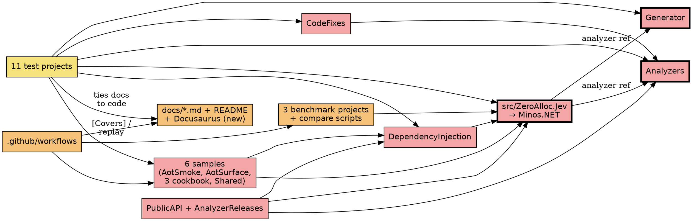

# Impact Analysis: Phase 6.1 — rename ZeroAlloc.Jev to Minos and move out of the ZeroAlloc org

Input: `docs/superpowers/specs/2026-10-09-phase-6.1-rename-design.md`. The targets were confirmed by the maintainer on 2026-10-09.

## Summary

| Metric | Value |
|---|---|
| Date | 2026-10-09 |
| Refactor Type | Rename + move, repository-wide; plus a change of interface on the public API and analyzer IDs, and the move of the docs site and CI infrastructure |
| Targets | 12 (see the target table in the spec) |
| Directly Affected Files | ~482 tracked files mention `Jev`. Planning and history documents and `CHANGELOG.md` are excluded and stay as they are. |
| Paths renamed | ~475 tracked paths contain `Jev`, across 25 projects. |
| Transitively Affected Files | 0 beyond the direct set. The rename changes every public name, so the direct set is already the full closure: every consumer of the public surface mentions it by name. |
| Total Affected Files | ~482 edited, ~475 moved, plus new files (Docusaurus site, `docs.yml`, `renovate.json`, logo, no-Jev test) and 2 workflows deleted |
| Breaking Changes | All public names, namespaces, package ids, analyzer IDs and telemetry names. 0.x line, nothing published. |
| Risks Identified | 12 |
| Risk Level | **High**: more than 50 files, and several high-severity string-based references |

### Reference inventory, by kind

| Kind | Count | Notes |
|---|---|---|
| `ProjectReference`/paths in `.csproj`, `.props`, `.slnx` | 130 refs / 24 files | Atomic with the folder moves |
| `InternalsVisibleTo` | 6 refs / 5 files | Assembly-name strings; atomic with the assembly rename |
| Metadata-name strings in generator, analyzers and code fixes (`"ZeroAlloc.Jev.…"`) | 11 refs / 6 files | **String-based.** The generator finds `[JevQuestions]` by fully qualified metadata name; a miss makes it emit nothing, with no compile error. |
| `[Covers("<PublicAPI line>")]` in the AOT smoke app and tests | 138 refs / 28 files | **String-based.** They quote PublicAPI lines verbatim, so they change with every namespace and type rename. The entry-point coverage test fails on any mismatch. |
| Telemetry and identity strings in `src` (ActivitySource, Meter, User-Agent, logger category) | 16 refs / 5 files | **String-based**, and asserted by the observability name tests and docs tables |
| Workflows naming paths or `jev` | 29 refs / 6 files | `ci.yml` paths, `aot-surface` roots, `docs-site.yml`, `trigger-website.yml`, `benchmarks*.yml`, `live-smoke.yml` |
| Benchmark harness, scripts and results | 68 refs / 10 files | The adapter label `"ZeroAlloc.Jev"`, `merge.py` tests, and the published `results/ci-run-1..3.json` |
| Docs and pack tests with repository paths or names | 161 refs / 55 files | Includes the 5 repo-root finders keyed on `ZeroAlloc.Jev.slnx`: `PublishedPages`, `SnippetSourceTests`, `AotSmoke.Tests/Repository`, `PackTests/PackedProject`, and the user-visible `samples/…Samples.Shared/SampleHost.cs` |
| Generator snapshot files | 15 files | File names embed the hint name `….JevQuestions.g.cs`, from `SourceEmitter.cs:73`, and their contents embed type names |
| `JEV` analyzer IDs in `src`, tests, docs and samples | 335 refs / 34 files | Diagnostic descriptors, code-fix registrations, tests, the diagnostics page, `.editorconfig` mentions, release-tracking files |
| `jev.zeroalloc.net` and `ZeroAlloc-Net/ZeroAlloc.Jev` URLs | 55 refs / 14 files | README, docs links, help links, `PackageProjectUrl`/`RepositoryUrl` |
| Sample `recordings.json` | 0 | Bodies only, never headers, so no User-Agent is recorded |

## Dependency Graph

The projects depend on each other as follows. The rename changes every node; the graph governs which changes must land together.

Red means breaking, orange means update required, yellow means test impact. A bold border marks a target.

## Affected Files

Grouped by the area that changes together. Counts come from `git grep` on 2026-10-09; the plan's tasks list exact paths.

| # | Area / files | Classification | Change Required | Caused By | Complexity |
|---|---|---|---|---|---|
| 1 | `src/ZeroAlloc.Jev/**` (97 files) | Breaking | Folder, csproj and assembly → `Minos.NET`; namespace → `Minos`; types per the mapping; telemetry and User-Agent strings | T1, T2, T3, T6 | Trivial to moderate (mechanical, large) |
| 2 | `src/ZeroAlloc.Jev.Generator/**` (10) | Breaking | Namespace; the metadata name of `[Questions]`; emitted type names; hint name `.JevQuestions.g.cs` → `.Questions.g.cs` | T1–T4 | Moderate: string-based lookups |
| 3 | `src/ZeroAlloc.Jev.Analyzers/**`, `CodeFixes/**` (8) | Breaking | Namespace; metadata-name strings; IDs `JEV` → `MIN`; help links; release-tracking Unshipped entries | T1–T3, T5, T7 | Moderate |
| 4 | `src/ZeroAlloc.Jev.DependencyInjection/**` (4) | Breaking | `AddJevClient` → `AddDecisionClient`; namespace; types | T1–T3 | Trivial |
| 5 | `src/*/PublicAPI.Shipped.txt`, `PublicAPI.Unshipped.txt`, `AnalyzerReleases.*.md` | Breaking | Shipped files untouched; old lines `*REMOVED*`, new lines added; removed and new rule tables | T7 | Moderate: the analyzers' formats are strict |
| 6 | `ZeroAlloc.Jev.slnx`, `Directory.Build.props`, `Directory.Packages.props`, `mdsnippets.json` | Breaking | Solution → `Minos.NET.slnx`; shared package metadata (authors, URLs, icon, tags) as in Thalos.NET | T1, T8 | Trivial |
| 7 | 5 repo-root finders: `PublishedPages.cs`, `SnippetSourceTests.cs`, `AotSmoke.Tests/Repository.cs`, `PackTests/PackedProject.cs`, `Samples.Shared/SampleHost.cs`; and `SamplesTests.cs:97` | Breaking | `"ZeroAlloc.Jev.slnx"` → `"Minos.NET.slnx"` | T1 | Trivial, but **atomic with the solution rename** |
| 8 | `samples/ZeroAlloc.Jev.AotSmoke/**` (41), `AotSurface/**` (5) | Breaking | Paths, namespaces, types; 138 `[Covers]` PublicAPI-line strings; `TrimmerRootAssembly` names | T1–T3, T7 | Moderate: string-based, checked by the coverage test |
| 9 | Cookbook samples and Shared (31) | Breaking | Paths, namespaces, types; `SampleHost` root finder; READMEs | T1–T3 | Trivial |
| 10 | `tests/ZeroAlloc.Jev.Tests/**` (64), `Integration` (14), `DependencyInjection` (9), `Live` (8) | Test Impact | Paths, namespaces, types; telemetry-name assertions | T1–T3, T6 | Trivial |
| 11 | `tests/ZeroAlloc.Jev.Generator.Tests/**` (19 + 15 snapshots) | Test Impact | Namespaces and types in sources under test; regenerate snapshots (file names and contents); check name-only diffs | T2–T4 | Moderate: review volume |
| 12 | `tests/ZeroAlloc.Jev.Analyzers.Tests/**` (10) | Test Impact | `JEV` → `MIN` in expected diagnostics; types | T3, T5 | Trivial |
| 13 | `tests/ZeroAlloc.Jev.Docs.Tests/**` (50) | Test Impact | Snippet regions in renamed code; tests tying tables to code (diagnostics IDs, telemetry names, defaults); README tests (Status, About the name, links); root finder | T2, T3, T5, T6, T9 | Moderate |
| 14 | `tests/ZeroAlloc.Jev.PackTests/**` (5) | Test Impact | Package ids, tags, metadata, the icon hash pins → new logo; root finder | T1, T8 | Trivial |
| 15 | `tests/ZeroAlloc.Jev.AotSmoke.Tests/**` (10), `Samples.Tests` (12), `Benchmarks.Tests` (8) | Test Impact | Paths, root finder, PublicAPI-line coverage, types | T1–T3 | Trivial |
| 16 | `docs/*.md`, `docs/patterns/*.md` (published pages) | Update Required | Names, snippets (via `dotnet mdsnippets`), diagnostics IDs, telemetry names, links → GitHub Pages URL | T2, T3, T5, T6, T9 | Moderate: prose plus regenerated snippets |
| 17 | `README.md` | Update Required | Title, logo, install lines, Status, provider line, **"About the name"** and the one-liner, links | T8, T9 | Trivial |
| 18 | New: `docusaurus.config.ts`, `sidebars.ts`, `package.json` with lockfile, `src/css`, `.github/workflows/docs.yml`; deleted: `docs-site.yml`, `trigger-website.yml` | Update Required | Docs site into the repository, modelled on Rag.NET; Pages deploy | T10 | Moderate |
| 19 | `.github/workflows/ci.yml`, `benchmarks*.yml`, `live-smoke.yml`, `release-please.yml` | Breaking | Paths and project names; `ship-release-tracking` → an in-repo job; `renovate.json` with the preset | T1, T11 | Moderate (ship-release-tracking) |
| 20 | `benchmarks/ZeroAlloc.Jev.Benchmarks*` (36), `benchmarks/compare/**` scripts and tests (8) | Breaking | Paths, names; adapter label `"ZeroAlloc.Jev"` → `"Minos.NET"` for new runs; `run.ps1`/`run.sh` project paths; `test_merge.py` fixtures | T1, T12 | Trivial |
| 21 | `benchmarks/compare/results/ci-run-1..3.json` and `docs/performance.md` | Update Required | **Results stay unchanged** (measured data). The performance page states those runs were measured as ZeroAlloc.Jev 0.5.x before the rename, and the tests that tie its claims to the JSON accept that label. | T12 | Moderate |
| 22 | `assets/icon.svg`, `assets/icon.png` → new Minos logo (`logo-design`, maintainer-approved) | Update Required | New files; pack and README references; the old ZeroAlloc.Rest icon removed | T8 | Moderate: needs approval |
| 23 | New test: the no-ZeroAlloc.Jev guard | Test Impact | Fails on `Jev`, `ZeroAlloc.Jev`, `ZeroAlloc-Net/ZeroAlloc.Jev` or `jev.zeroalloc.net` outside the spec's allow-list (which adds `benchmarks/compare/results/*.json`) | — | Trivial |
| 24 | Planning and history documents, `CHANGELOG.md` | Cosmetic, unchanged by design | History stays as written | — | — |

## Risk Register

| # | Risk | Affected Files | Severity | Mitigation |
|---|---|---|---|---|
| 1 | The generator finds the attribute by metadata-name **string**. A missed rename makes it silently generate nothing; typed tests would then fail only through missing members, or not at all for unused types. | Generator `*.cs` (11 strings) | High | Rename the strings in the same commit as the attribute. The generator snapshot tests and the AOT smoke's typed checks must pass. Add a test asserting the generator recognises `Minos.QuestionsAttribute` by name. |
| 2 | `[Covers]` strings quote PublicAPI lines. A stale one fails entry-point coverage, but only that test. | 28 files, 138 refs | High | Update them with the PublicAPI files in each group. The coverage test is the check. |
| 3 | The five root finders key on `ZeroAlloc.Jev.slnx`. If the solution is renamed alone, every docs, pack and AOT-smoke test fails, and so does the user-visible sample host. | 5 files | High | Atomic with the solution rename, in Group 1. |
| 4 | Telemetry names are runtime strings. Users' OpenTelemetry filters on `ZeroAlloc.Jev` silently stop matching. | `src` telemetry, docs observability | Medium (no published users) | Rename, documented as a breaking change in the changelog. The observability name tests change with it. |
| 5 | The PublicApiAnalyzers and release-tracking analyzers reject the churn: RS0016/RS0017 and RS2000–RS2008 run under TreatWarningsAsErrors. | PublicAPI and AnalyzerReleases files | High | Never edit shipped files. Use `*REMOVED*` lines and Removed Rules tables. Groups 1 and 2 each leave the build green. |
| 6 | The generated hint name changes (`.JevQuestions.g.cs`), which changes the snapshot file names. Verify would see new and obsolete snapshots. | 15 snapshot files | Medium | Regenerate them in a dedicated commit, delete the old files, and run a scripted check that the content diff is name-only. |
| 7 | **Cross-boundary:** the repository transfer drops org-provided pieces: `RELEASE_PLEASE_TOKEN` (an org secret), the "Main" ruleset, Renovate, and possibly `live-api`'s branch policy. | Outside the repository | High | The spec's step 2 checklist, verified before the phase closes. Live smoke 13/13 and a release-please run on the personal repository. |
| 8 | **External consumers:** ZeroAlloc-Net/.website still references `repos/jev`. Removing the app while jev.zeroalloc.net is live breaks the site. | .website, Cloudflare | Medium | Redirect jev.zeroalloc.net to the Pages URL first, then remove the app through a maintainer-approved .website PR. |
| 9 | `ship-release-tracking` lived in `ZeroAlloc-Net/.github`. Without a replacement, unshipped API and rules never move to shipped. | `release-please.yml` | Medium | An in-repo job doing the same, verified on the first release PR after the move. |
| 10 | **Serialized state:** the published benchmark results carry `"library": "ZeroAlloc.Jev"`. | `results/ci-run-*.json`, `performance.md`, docs tests | Medium | Keep the results immutable, explain the label on the page, and allow-list it in the guard test. |
| 11 | The docs site move: Docusaurus in the repository adds a Node toolchain and lockfile at the root, and `mdsnippets` must not touch `node_modules`. | Root, `mdsnippets.json` | Medium | Model it on Rag.NET. Add `node_modules` to `.gitignore` and to mdsnippets' excluded directories. CI `docs.yml` builds with `onBrokenLinks: 'throw'`. |
| 12 | `Question` and `Answer` collide with users' own types. | Raw-API users | Low | The guide notes the alias, and Phase 7.1 may revisit. |

**Circular dependencies:** none between projects. The core references the generator and analyzers only as analyzers, and the code fixes reference the analyzers. High fan-in: `src/ZeroAlloc.Jev` (every test, sample and benchmark project) and the PublicAPI lines (138 `[Covers]` strings).

## Execution Order

Each group ends with the solution building with 0 warnings and the full suite green. Each is one commit, or a small set of commits, that never leaves `main`-bound code red.

### Group 1: Assembly, project and namespace move (ATOMIC)

- `git mv` every `ZeroAlloc.Jev*` project folder and `.csproj` to `Minos.NET*`, and `ZeroAlloc.Jev.slnx` to `Minos.NET.slnx`.
- `RootNamespace`, `AssemblyName` and `PackageId`; the `ProjectReference` paths; `InternalsVisibleTo`.
- Namespace `ZeroAlloc.Jev[.*]` → `Minos[.*]` in every `.cs` file, including the generator's emitted namespaces and the metadata-name strings, which still name `JevQuestionsAttribute` at this point.
- The five repo-root finders and `SamplesTests.cs:97`.
- PublicAPI files: old lines `*REMOVED*`, new namespace lines added. `[Covers]` strings updated to match.
- Workflows: every project and solution path in `ci.yml`, `benchmarks*.yml` and `live-smoke.yml`, and the `aot-surface` roots. Benchmark scripts' paths.
- **Checkpoint:** build, full suite, AOT surface and smoke locally; commit.

### Group 2: Type and member renames (ATOMIC)

- Every public and internal type and member per the mapping, through src, generator emission, analyzers, code fixes, DI, samples, benchmarks and tests.
- The generator's metadata-name strings: `Minos.QuestionsAttribute`. The hint name: `.Questions.g.cs`.
- PublicAPI Unshipped lines updated; `[Covers]` strings updated.
- Snapshots regenerated in a separate commit within the group, with old files deleted and the name-only diff checked.
- Snippet regions in docs tests renamed; `dotnet mdsnippets` regenerates the pages' code blocks. Docs prose that names types follows.
- **Checkpoint:** build, full suite, entry-point coverage, AOT; `dotnet mdsnippets` with `git diff --exit-code` clean; commit.

### Group 3: Analyzer IDs `JEV` → `MIN`

- The descriptors, code-fix registrations, analyzer tests, and AnalyzerReleases Unshipped (removed and new tables).
- The diagnostics page, its anchors, and the docs tests tying the page to the rules.
- **Checkpoint:** build, analyzer and docs tests; commit.

### Group 4: Telemetry and identity strings

- `ActivitySource`, `Meter` and logger category → `Minos`; log templates; User-Agent → `Minos.NET`.
- The observability page tables and name tests; the integration tests asserting User-Agent or source names.
- **Checkpoint:** build, full suite; commit.

### Group 5: Package metadata, logo and README

- `Directory.Build.props` shared metadata as in Thalos.NET: authors, copyright, URLs, `PackageIcon` `logo.png`, tags.
- The new logo, from `logo-design` and approved by the maintainer, in `assets/`; the old icon removed; the pack tests' hash pins.
- README: title, logo, install, Status, provider line, the one-liner and **"About the name"**, links → GitHub Pages and `MarcelRoozekrans/Minos.NET`. The README tests follow.
- **Checkpoint:** build, pack and docs tests; commit.

### Group 6: Docs site into the repository

- Docusaurus config, sidebars, `package.json` with its lockfile and CSS, modelled on Rag.NET. `docs.yml` deploys to Pages. `docs-site.yml` and `trigger-website.yml` are deleted.
- `.gitignore` and `mdsnippets.json` exclude `node_modules` and the build output.
- Docs links and analyzer help links → the Pages URL.
- `performance.md` explains the historical benchmark label. The benchmark adapter label → `"Minos.NET"`; `test_merge.py` fixtures.
- **Checkpoint:** the Docusaurus build locally with `onBrokenLinks: 'throw'`, the docs tests, `pytest` for the compare scripts; commit.

### Group 7: CI independence from the ZeroAlloc org

- An in-repo replacement for `ship-release-tracking` in `release-please.yml`.
- `renovate.json` extending the maintainer's `renovate-config` preset; `.commitlintrc.yml` kept.
- **Checkpoint:** workflow YAML parses; actionlint if available; commit.

### Group 8: The guard

- The no-ZeroAlloc.Jev test, with the spec's allow-list plus the historical benchmark results.
- **Checkpoint:** the full suite; the guard fails if one stray `Jev` is put back by hand. Commit.

### Then: PR, merge, and the outside steps

The spec's section 2, in order:
1. The repository transfer and rename.
2. Secrets, the ruleset and Renovate on the personal repository.
3. GitHub Pages enabled.
4. The jev.zeroalloc.net redirect, then the .website removal PR.
5. A live smoke run on `main`, 13/13.
6. A release-please run on the personal repository.
