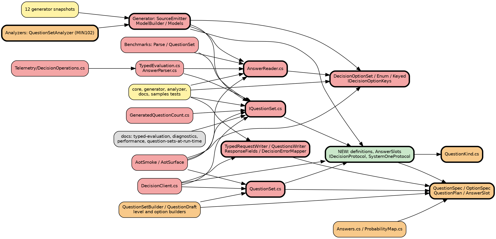

# Impact Analysis: Phase 6.2, the neutral question model and adapter boundary

Spec: `docs/superpowers/specs/2026-10-10-phase-6.2-neutral-question-model-design.md`. The targets were confirmed by the maintainer on 2026-10-10.

## Summary

| Metric | Value |
|---|---|
| Date | 2026-10-10 |
| Refactor type | Architectural, plus interface changes |
| Targets | 11 |
| Directly affected files | 71 |
| Transitively affected files | 14 |
| Total affected files | 85, including 12 generator snapshots |
| Breaking changes | 5 public members or types removed or made internal |
| Risks identified | 9 |
| Risk level | High: more than 50 files, and one high-severity cross-boundary risk, the wire bytes |

## Targets

| # | Target | Type |
|---|---|---|
| T1 | `IQuestionSet<TSelf>.QuestionsUtf8` → `Definition` | Change interface |
| T2 | `IQuestionSet<TSelf>.Parse(ref Utf8JsonReader)` → `Create(AnswerSlots)` | Change interface |
| T3 | `QuestionSet.QuestionsUtf8` → `Definition`; internal `QuestionSet.Parse` moves into the protocol | Change interface |
| T4 | `AnswerReader`: public → internal, under the protocol | Move |
| T5 | `DecisionOptionSet<T>.IndexOfKey` and internal `IDecisionOptionKeys` removed | Change interface |
| T6 | `QuestionKind`: internal → public | Change interface, additive |
| T7 | `QuestionSpec`, `OptionSpec`, `QuestionPlan` and `AnswerSlot` reconciled with the definition | Architectural |
| T8 | systemone wire code → `SystemOneProtocol` behind `IDecisionProtocol` | Extract |
| T9 | Generator emits `Definition` and `Create` | Change interface |
| T10 | MIN102 reserved names | Rename |
| T11 | New types: `QuestionSetDefinition`, `QuestionDefinition`, `OptionDefinition`, `AnswerSlots`, `IDecisionProtocol`, `SystemOneProtocol` | Extract, new |

Out of scope, by decision: the raw API and its DTOs (`SystemOneRequest`, `SystemOneResponse`, `Question`, `Answer` and subtypes, `DecisionProvider`), and `ListModelsAsync`.

## Dependency Graph

Red is Breaking, orange is Update Required, yellow is Test Impact, gray is Cosmetic or docs, and green is new. Targets have a bold border.

**Transitive closure:** depth 2 adds `DecisionOperations`, through `AnswerParser` and `GeneratedAnswerParser<T>`. It also adds `GeneratedQuestionCount`, which parses `T.QuestionsUtf8` to count questions, and the smoke, surface and benchmark projects. Depth 3 adds no new files. `DecisionClient`'s public surface is unchanged, so the closure stops there.

## Affected Files

### Breaking: fails to compile or run without a change

| # | File | Change required | Caused by | Complexity |
|---|---|---|---|---|
| 1 | `src/Minos.NET/IQuestionSet.cs` | Replace `QuestionsUtf8` and `Parse` with `Definition` and `Create(AnswerSlots)` | T1, T2 | Trivial |
| 2 | `src/Minos.NET/QuestionSet.cs` | Replace `QuestionsUtf8` with `Definition`. Its `Parse` becomes the protocol's slot reading, and `Answers` is built from slots | T3, T7 | Moderate |
| 3 | `src/Minos.NET/AnswerReader.cs` | Make internal and move under the protocol. Read through the definition's option keys instead of `IndexOfKey` | T4, T5 | Moderate |
| 4 | `src/Minos.NET/DecisionOptionSet.cs` | Remove `IndexOfKey(ref Utf8JsonReader)` and the `IDecisionOptionKeys` base | T5 | Trivial |
| 5 | `src/Minos.NET/EnumOptionSet.cs` | Remove its `IndexOfKey` override; its keys move into the definition | T5 | Trivial |
| 6 | `src/Minos.NET/KeyedOptionSet.cs` | Same as row 5 | T5 | Trivial |
| 7 | `src/Minos.NET/IDecisionOptionKeys.cs` | Delete; its role passes to the definition's UTF-8 option keys | T5 | Trivial |
| 8 | `src/Minos.NET/QuestionPlan.cs` | Derive from the definition or remove; it holds `IDecisionOptionKeys` | T5, T7 | Moderate |
| 9 | `src/Minos.NET/DecisionClient.cs` | Its six `T.QuestionsUtf8` and `questionSet.QuestionsUtf8` call sites at lines 278–366 go through the protocol: request bytes from the definition, answers through slots and `Create` | T1, T3, T8 | Moderate |
| 10 | `src/Minos.NET/TypedEvaluation.cs` | Parsing the response envelope and answers object moves to the protocol. `FromResponse`, `ParseAnswersObject` and `ParseResponse` take the protocol and a slot factory | T2, T8 | Moderate |
| 11 | `src/Minos.NET/AnswerParser.cs` | The `AnswerParser<T>` delegate over `Utf8JsonReader` becomes a factory over `AnswerSlots`, or is replaced by it. `GeneratedAnswerParser<T>` calls `T.Create` | T2 | Moderate |
| 12 | `src/Minos.NET/Telemetry/DecisionOperations.cs` | Use the new parser or factory | T2 | Trivial |
| 13 | `src/Minos.NET/GeneratedQuestionCount.cs` | Count `T.Definition.Questions.Count` instead of parsing `T.QuestionsUtf8` | T1 | Trivial |
| 14 | `src/Minos.NET/Transport/TypedRequestWriter.cs` | Becomes the systemone request writer. The shared state-writing helpers stay; the `questions` bytes come from the protocol's cache | T8 | Moderate |
| 15 | `src/Minos.NET/Serialization/QuestionsWriter.cs` | Writes from `QuestionSetDefinition` instead of `QuestionSpec[]`, inside `SystemOneProtocol`. Output must stay byte-identical | T7, T8 | Moderate |
| 16 | `src/Minos.NET/Telemetry/ResponseFields.cs` | Reading the response envelope moves behind the protocol | T8 | Moderate |
| 17 | `src/Minos.NET/Transport/DecisionErrorMapper.cs` | Reading error bodies moves behind the protocol. The mapping logic is unchanged | T8 | Moderate |
| 18 | `src/Minos.NET/PublicAPI.Shipped.txt`, `PublicAPI.Unshipped.txt` | `*REMOVED*` entries for T1–T5, and new entries for T6 and T11 | all | Trivial |
| 19 | `src/Minos.NET.Generator/SourceEmitter.cs` | Emit `Definition`, built with the factories, and `Create`, built from slot accessors. Stop emitting the literal, `Parse` and `IndexOfKey` | T9 | Complex |
| 20 | `src/Minos.NET.Generator/ModelBuilder.cs` | Model Score-level keys, the instruction and criterion content each factory needs, and probability offsets. Update `ReservedPropertyNames` | T9, T10 | Moderate |
| 21 | `src/Minos.NET.Generator/Models.cs` | Fields for the above | T9 | Trivial |
| 22 | `src/Minos.NET.Generator/JsonText.cs` | Keep it if criteria JSON is still emitted as text for `Criterion.Json`; otherwise remove it | T9 | Trivial |
| 23 | `samples/Minos.NET.AotSmoke/AllocationChecks.cs` | The checks on `Parse`, the `AnswerReader` primitives and `IndexOfKey` (lines 45–104, 751, 790) move to `Create` over fixed slots and the end-to-end typed parse. Budgets must be equal or lower | T2, T4, T5 | Moderate |
| 24 | `samples/Minos.NET.AotSmoke/AnswerReaderChecks.cs` | `MissingAnswer` is no longer public. Check the missing-answer error end to end instead | T4 | Trivial |
| 25 | `samples/Minos.NET.AotSmoke/DecisionOptionSetChecks.cs` | Drop the `IndexOfKey` and `AnswerReader` use | T4, T5 | Trivial |
| 26 | `samples/Minos.NET.AotSmoke/IQuestionSetChecks.cs`, `SmokeAnswers.cs` | Use `Definition` and `Create` | T1, T2 | Trivial |
| 27 | `samples/Minos.NET.AotSmoke/Program.cs` | Five `QuestionsUtf8` content checks at lines 193–354 read the request body a canned handler captures, or assert on the `Definition` | T1, T3 | Moderate |
| 28 | `samples/Minos.NET.AotSmoke/CriterionChecks.cs`, `QuestionSetBuilderChecks.cs` | Same as row 27, for built sets | T3 | Moderate |
| 29 | `samples/Minos.NET.AotSurface/Program.cs`, `SurfaceGenerics.cs` | Root `Definition`, `Create`, `AnswerSlots` and the new public types instead of `QuestionsUtf8` and `AnswerReader` | T1, T4, T11 | Trivial |
| 30 | `benchmarks/Minos.NET.Benchmarks/ParseBenchmarks.cs` | Benchmark the protocol's slot reading plus `Create`; the project has `InternalsVisibleTo` | T2, T4, T5 | Moderate |
| 31 | `benchmarks/Minos.NET.Benchmarks/QuestionSetBenchmarks.cs` | Same, for built sets | T3 | Trivial |

### Update required: still works, but is wrong or inconsistent

| # | File | Change required | Caused by | Complexity |
|---|---|---|---|---|
| 32 | `src/Minos.NET/QuestionKind.cs` | Make public with XML docs | T6 | Trivial |
| 33 | `src/Minos.NET/Validation/QuestionSpec.cs`, `OptionSpec.cs`, `QuestionSetSpec.cs`, `QuestionValidation.cs` | Validation stays on the spec; `Build()` maps a valid spec to the public definition. Alternatively the spec becomes the definition's builder input. The plan picks one | T7 | Moderate |
| 34 | `src/Minos.NET/QuestionSetBuilder.cs`, `QuestionDraft.cs` | `Build()` produces a `QuestionSetDefinition` and no longer writes the questions bytes | T3, T7 | Moderate |
| 35 | `src/Minos.NET/KeyedChoiceOptionsBuilder.cs`, `KeyedScoreLevelsBuilder.cs`, `ScoreLevelsBuilder.cs` | Carry Score-level keys into the definition | T7 | Trivial |
| 36 | `src/Minos.NET/AnswerSlot.cs` | Stays internal. `AnswerSlots` wraps a span of it | T7, T11 | Trivial |
| 37 | `src/Minos.NET/Answers.cs` | Built from slots and the definition, as now; read keys from the definition | T7 | Trivial |
| 38 | `src/Minos.NET/ProbabilityMap.cs` | Its doc comment names `AnswerReader` and the generated `Parse` | T2, T4 | Trivial |
| 39 | `src/Minos.NET/Transport/IDecisionApi.cs`, `DisposalGuardDecisionApi.cs`, `RawJson.cs`, `Telemetry/Evaluated.cs`, `Telemetry/ConfidenceValues.cs` | Check them against the protocol seam. They carry bytes or results; any systemone-specific read moves | T8 | Trivial |
| 40 | `src/Minos.NET.Analyzers/QuestionSetAnalyzer.cs`, `AnalyzerReleases.Unshipped.md` | MIN102's reserved names become `Definition` and `Create`; update the comment at line 51 | T10 | Trivial |
| 41 | `src/Minos.NET.Analyzers/EnumUsageIndex.cs` | Uses its own `QuestionKind`; check for a name clash once core's becomes public | T6 | Trivial |

### Test impact

| # | File | Change required | Caused by | Complexity |
|---|---|---|---|---|
| 42–53 | `tests/Minos.NET.Generator.Tests/Snapshots/*.verified.cs`, all 12 | Regenerate and review for shape | T9 | Trivial |
| 54 | `tests/Minos.NET.Generator.Tests/DiagnosticTests.cs`, `Sources.cs` | MIN102 cases for the new reserved names; `IQuestionSet` references | T9, T10 | Trivial |
| 55 | `tests/Minos.NET.Analyzers.Tests/GeneratedCodeTests.cs`, `MovedDiagnosticTests.cs` | Reserved names and `QuestionKind` | T10 | Trivial |
| 56 | `tests/Minos.NET.Tests/AnswerReaderTests.cs`, `AnswerReaderCoreTests.cs`, `TypedAnswerTests.cs`, `EnumOptionSetTests.cs`, `TestOptionSets.cs` | Re-point to the protocol's slot reader; the project has `InternalsVisibleTo`. Expectations stay unchanged | T4, T5 | Moderate |
| 57 | `tests/Minos.NET.Tests/GeneratedQuestionSetTests.cs`, `GeneratedQuestionCountTests.cs` | Its three hand-written malformed sets test JSON counting, which no longer exists. Replace them with definition counts | T1, T2 | Moderate |
| 58 | `tests/Minos.NET.Tests/QuestionSetBuilderTests.cs`, `QuestionSetPlanTests.cs`, `BuiltSetAllocationTests.cs` | Assert on the `Definition`, and on the protocol's bytes for the wire | T3, T7 | Moderate |
| 59 | `tests/Minos.NET.Tests/BuilderGeneratorDifferentialTests.cs` | Already compares built and generated bytes; extend it to definition equality | T3, T9 | Trivial |
| 60 | `tests/Minos.NET.Tests/TypedRequestWriterTests.cs`, `TypedEvaluationTests.cs`, `TypedEvaluationDefaultTests.cs`, `DecisionClientTypedTests.cs`, `DecisionErrorMapperTests.cs`, `FakeOperations.cs`, `ResponseAnswers.cs`, `OperationsCostTests.cs` | Follow the moved writer, parser and mapper signatures | T2, T8 | Moderate |
| 61 | `tests/Minos.NET.Tests/QuestionSpecValidationTests.cs`, `QuestionValidationTests.cs` | `QuestionKind` is public now, otherwise unchanged | T6 | Trivial |
| 62 | `tests/Minos.NET.Docs.Tests/TypedEvaluationTests.cs`, `QuestionSetsAtRunTimeTests.cs`, `DiagnosticsTests.cs`, `CannedDecision.cs` | Update the snippets; add the "Reading a question set's definition" region | T1, T3 | Moderate |
| 63 | `tests/Minos.NET.Samples.Tests/Canned.cs` | Generic constraint only; recompile | T2 | Trivial |
| 64 | New: `tests/Minos.NET.Tests/WireBytesFixtureTests.cs` and fixtures | Today's bytes for every generator and builder case, captured from `main` before the change | proof | Moderate |
| 65 | New: definition, `AnswerSlots`, cache and seam tests | See the spec's Tests section | T11 | Moderate |

### Cosmetic or docs

| # | File | Change required | Caused by |
|---|---|---|---|
| 66 | `docs/typed-evaluation.md` | Line 315: what the generator writes | T1, T2 |
| 67 | `docs/diagnostics.md` | Lines 32, 52 and 152: MIN102 and invalid sets | T10 |
| 68 | `docs/performance.md` | Lines 11 and 37: `Parse`, `AnswerReader` and the literal | T1, T4 |
| 69 | `docs/question-sets-at-run-time.md` | New section, "Reading a question set's definition" | T11 |
| 70 | `docs/planning/STATE.md`, `ROADMAP.md` | They mention `QuestionsUtf8` historically; update at phase end only | none |

The integration tests that name `/v1/systemone` are not affected: `WireFormatTests`, `WireMockFixture`, `ErrorMappingTests` and the rest stub the endpoint, and the wire is unchanged. They are the proof that the wire did not change, so their expectations must not be edited.

## Risk Register

| # | Risk | Affected files | Severity | Mitigation |
|---|---|---|---|---|
| 1 | **Cross-boundary: the wire bytes drift.** Escaping, property order, null Choice criteria, Score criteria order, JSON-valued instructions | `QuestionsWriter`, `SystemOneProtocol`, the generator | High | Capture byte fixtures from `main` first, in Group 0. Assert byte equality for every generator and builder case. The protocol reuses `GeneratorJsonEncoder`. The WireMock tests stay unedited. |
| 2 | **Implicit coupling: the generator's literal and the builder's writer are two encoders today.** The single protocol writer must reproduce both | `SourceEmitter`/`JsonText`, `QuestionsWriter` | High | `BuilderGeneratorDifferentialTests` already proves they agree. The fixtures pin both outputs before either changes. |
| 3 | **A `ref struct` parameter on a static abstract member.** `Create(AnswerSlots)` must compile under Roslyn 5, C# and the AOT surface | `IQuestionSet`, the generator | Medium | Group 1 spike: a hand-written set compiled and AOT-published before the generator changes. Fallback: `Create(in AnswerSlotsView)` over a readonly struct holding an array segment. That allocates, so it fails the budgets and needs a decision. |
| 4 | **High fan-in: `AnswerReader`.** 17 files reference it | the readers, tests, smoke, benchmarks | Medium | Make it internal last, in Group 5, after every caller has moved. Tests keep access through `InternalsVisibleTo`. |
| 5 | **A loosened allocation budget**, from the slots path or the first-use serialization | `AllocationChecks`, `DecisionClient` | Medium | Stack-allocate the slots. Cache the bytes on the definition. Compare budgets to `main` in Group 6; a regression blocks the phase. |
| 6 | **AOT smoke loses its view of the request JSON.** Five checks parse `QuestionsUtf8` | `AotSmoke/Program.cs`, `CriterionChecks`, `QuestionSetBuilderChecks` | Medium | Capture the request body through the smoke's canned `HttpMessageHandler`, so the checks still see the real wire under AOT. |
| 7 | **Name clash: core's `QuestionKind` becomes public**, and the analyzer and generator assemblies have their own internal `QuestionKind` | `EnumUsageIndex`, generator `Models` | Low | They are separate assemblies with no reference to core, so there is no clash. Verify in Group 1. |
| 8 | **Serialized state: the docs snippets and the samples' recorded answers** | `Docs.Tests`, `Samples.Tests` | Low | The recorded answers are wire responses and stay valid. The snippets regenerate through `mdsnippets`. |
| 9 | **External consumers** | — | Low | Nothing is on NuGet yet; v0.6.0 is a GitHub release only. Generated code regenerates on rebuild. The break is recorded in a `BREAKING CHANGE` footer. |

No dynamic references, runtime registration or circular dependencies were found. `GeneratedAnswerParser<T>` resolves `T.Parse` statically, and nothing reaches the targets through reflection; the one reflection use is documented in `native-aot.md` and is unrelated.

## Execution Order

### Group 0: Capture the proof, before any change
- New `WireBytesFixtureTests` and fixtures: write today's `QuestionsUtf8` for every generator snapshot case and every `QuestionSetBuilderTests` case, plus one full request body per state kind, to fixture files.
- **Checkpoint:** tests green on the unchanged code, then commit.

### Group 1: The new model, additive, with the spike
- `QuestionKind` made public.
- New `QuestionSetDefinition`, `QuestionDefinition` with its factories, `OptionDefinition`, and `AnswerSlots` over `AnswerSlot`.
- A test-only, hand-written set implementing a local interface with `static abstract TSelf Create(AnswerSlots)`, compiled and published under the AOT surface. This proves Risk 3 before anything depends on it.
- **Checkpoint:** build, tests, AOT surface publish, then commit.

### Group 2: The protocol behind the old API, additive
- New `IDecisionProtocol` and `SystemOneProtocol`:
  - the questions writer from a definition, with the per-protocol cache;
  - the request envelope, reusing the `TypedRequestWriter` state helpers;
  - response and answer reading into slots, using `AnswerReader` internally;
  - the error-body reading from `DecisionErrorMapper`.
- `QuestionSetBuilder.Build()` also produces `Definition`. `QuestionSet` exposes it next to `QuestionsUtf8`.
- Byte-equality tests: the protocol's bytes against the Group 0 fixtures, for built sets.
- **Checkpoint:** tests green and fixtures equal, then commit.

### Group 3: Generator and interface, emitting both — ATOMIC
- `IQuestionSet<TSelf>` gains `Definition` and `Create`, keeping `QuestionsUtf8` and `Parse` for now.
- `SourceEmitter`, `ModelBuilder` and `Models` emit both the old and the new members.
- Every hand-written `IQuestionSet` implementer, the three in `GeneratedQuestionCountTests`, must change in the same commit.
- The 12 snapshots are regenerated.
- Byte-equality tests for generated sets: the protocol's bytes from `T.Definition` against the fixtures.
- `BuilderGeneratorDifferentialTests` is extended to definition equality.
- **Checkpoint:** build, all tests, then commit.

### Group 4: Switch the client to the seam
- `DecisionClient`, `TypedEvaluation`, `AnswerParser`/`GeneratedAnswerParser` (`T.Create` over slots), `DecisionOperations` and `GeneratedQuestionCount` go through the protocol and the definition.
- `QuestionSet` parses through the protocol.
- `ResponseFields` and `DecisionErrorMapper` sit behind the protocol.
- The seam test with a fake `IDecisionProtocol`.
- **Checkpoint:** the full suite with unchanged integration expectations, samples replay, the AOT smoke run, then commit.

### Group 5: Remove the old surface — ATOMIC
- Remove `IQuestionSet.QuestionsUtf8` and `Parse`, and `QuestionSet.QuestionsUtf8`.
- `AnswerReader` becomes internal.
- Remove `DecisionOptionSet<T>.IndexOfKey`, its `EnumOptionSet` and `KeyedOptionSet` overrides, `IDecisionOptionKeys`, and `QuestionPlan` or its key lookup.
- The generator stops emitting the old members, and the snapshots are regenerated.
- MIN102 reserves `Definition` and `Create`, with its analyzer tests and `AnalyzerReleases` entry.
- PublicAPI files.
- AOT smoke and surface: the checks from rows 23–29.
- Benchmarks: rows 30–31.
- Tests: rows 56–58 and 60.
- **Checkpoint:** 0 warnings, the full suite, AOT surface and smoke, benchmarks build, then commit.

### Group 6: Docs, budgets and verification
- Docs rows 66–69, with the new snippet region and `mdsnippets`.
- Compare the allocation budgets to `main`: equal or lower, and the end-to-end budgets identical.
- One Live smoke run on the branch, then the pre-push review, with its report in `docs/plans/`.
- **Checkpoint:** every gate, then commit, then the PR.
